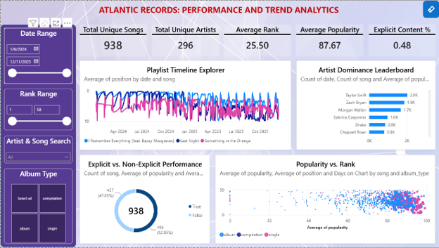
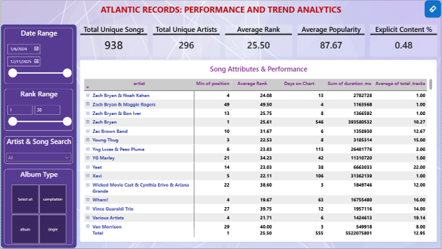
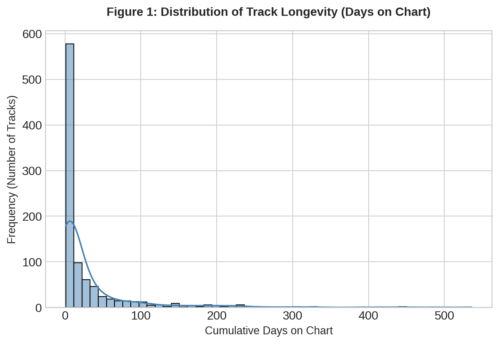
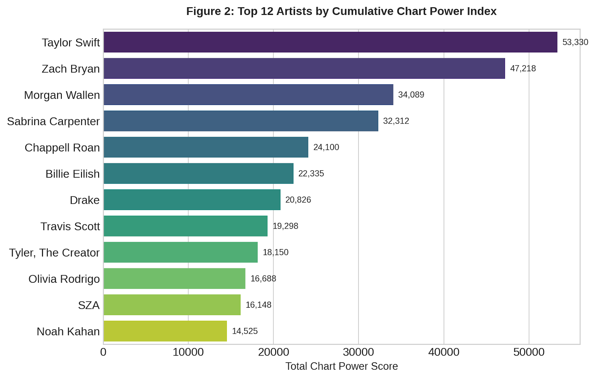
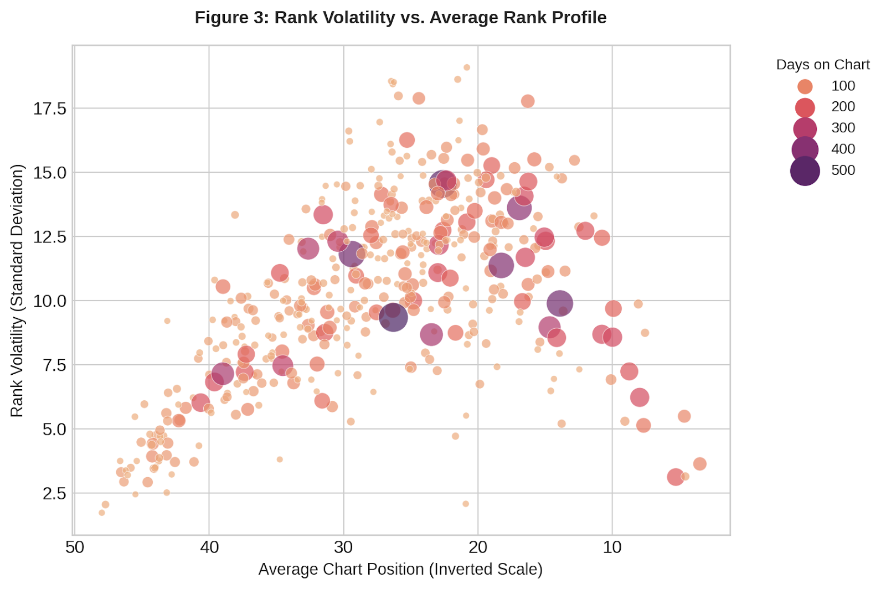
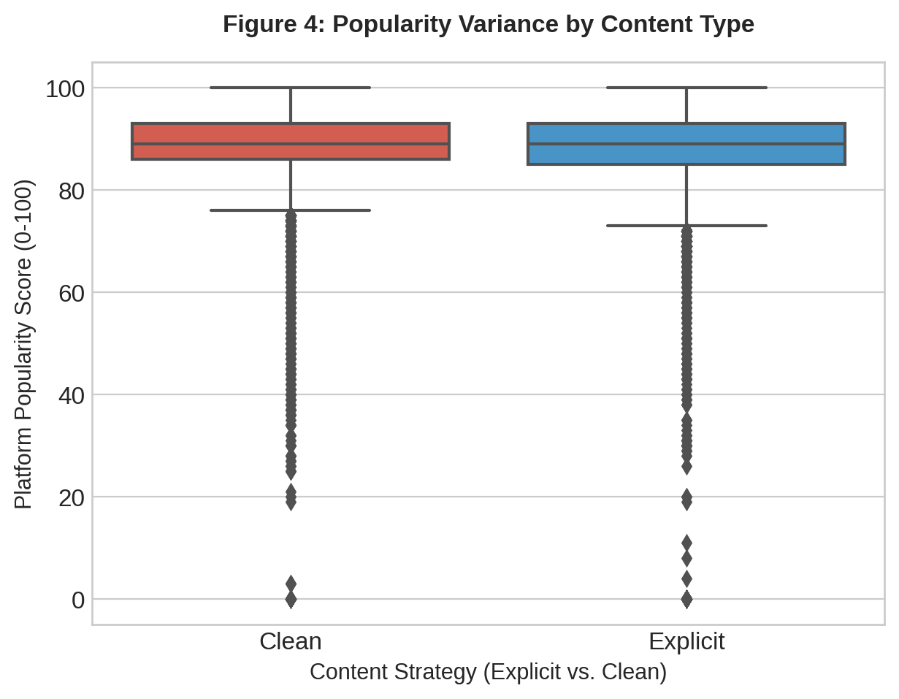

[README.md](https://github.com/user-attachments/files/30508406/README.md)
# 🎵 Atlantic Records: US Top 50 Chart Dynamics & Algorithmic Determinism

> An end-to-end data analytics portfolio project decoding track longevity, artist market concentration, and algorithmic determinism in the contemporary music streaming industry.

## 📑 Table of Contents
- [Project Overview](#project-overview)
- [Live Dashboard](#live-dashboard)
- [Tech Stack & Architecture](#tech-stack--architecture)
- [Engineered Metrics](#engineered-metrics)
- [Key Insights & Visualizations](#key-insights--visualizations)
- [Strategic Recommendations](#strategic-recommendations)

---

## 🔍 Project Overview
The contemporary recorded music industry is governed primarily by algorithmic discovery and playlist placement. For major record labels, understanding the mathematical lifecycles of tracks within the US Top 50 ecosystem is a critical business imperative. 

This project analyzes **27,800 daily chart records** to deconstruct market concentration, rank volatility, and the commercial viability of explicit content. It transitions raw streaming data through a Python ETL pipeline into a fully interactive Power BI / Streamlit environment to provide actionable A&R and marketing intelligence.

---

## 🌐 Live Dashboard
Explore the interactive data application here:  
👉 **[Atlantic Records Interactive Dashboard](https://atlantic-records-dashboard-fgen9urgaox4tmm3go8q7c.streamlit.app/)**

### Dashboard Previews

  
  

---

## 🛠️ Tech Stack & Architecture
* **Data Manipulation & ETL:** Python (Pandas, NumPy)
* **Statistical Analysis:** SciPy
* **Data Visualization:** Matplotlib, Seaborn, Plotly
* **Business Intelligence & Deployment:** Microsoft Power BI (DAX), Streamlit
* **Documentation & Reporting:** Jupyter Notebooks, Automated Word Generation

---

## 📐 Engineered Metrics
To correct for the flaw in traditional metrics (where a day at rank #50 is valued equally to a day at rank #1), novel metrics were engineered for this analysis:

1. **Chart Power Index (CPI):** An inversely weighted performance score calculated as `(51 - Daily Position)`. This accurately measures true market dominance.
2. **Rank Volatility:** The population standard deviation (`STDEV.P`) of a track's daily chart position, used to identify chart stability vs. erratic algorithmic spikes.

---

## 📊 Key Insights & Visualizations

### 1. The 7-Day Algorithmic Cliff (Survival Analysis)
A standard metric like 'Average Days on Chart' is dangerously misleading due to extreme outliers. Analyzing 943 unique songs reveals a severe right-skew in track lifespans. While the mean lifespan is 29.4 days, the **median lifespan is just 7.0 days**. The algorithm is ruthless to tracks that cannot sustain immediate listener retention.

  

### 2. Market Concentration (The Chart Power Index)
Applying the Chart Power Index reveals a heavily concentrated, oligopolistic market structure. Taylor Swift and Zach Bryan command a vastly disproportionate share of total chart visibility. Breaking mid-tier talent into the upper quartile without strategic features is statistically arduous.

  

### 3. Rank Volatility Profiling
Mapping average chart position against rank volatility reveals a 'Stability Threshold'. Tracks that survive past 200 days tend to cluster around mid-to-lower ranks with moderate volatility. Conversely, maintaining a Top 10 rank requires surviving intense daily volatility.

  

### 4. The Explicit Premium (Content Strategy)
The dataset confirms that **52% of total chart appearances are explicit tracks**. Furthermore, boxplot distributions indicate that Explicit tracks do not suffer any algorithmic penalty regarding platform Popularity scores; they actually exhibit a tighter cluster of peak scores.

  

---

## 💡 Strategic Recommendations for A&R / Marketing
1. **Front-Load Retention Marketing:** Because the median track dies within 7 days, marketing spend must focus entirely on listener retention metrics (reducing skip rates, pushing saves) in the first 96 hours.
2. **Embrace The Explicit Authentic:** Resources spent on fast-tracking 'clean radio edits' should be reallocated to digital marketing. The algorithm heavily rewards explicit tracks.
3. **Cross-Pollination via Features:** Given the massive market concentration at the top of the Chart Power Index, co-releases and strategic features with top-quartile artists are required to bypass algorithmic hurdles for emerging talent.

---

*Prepared by Hemant Sharma*
